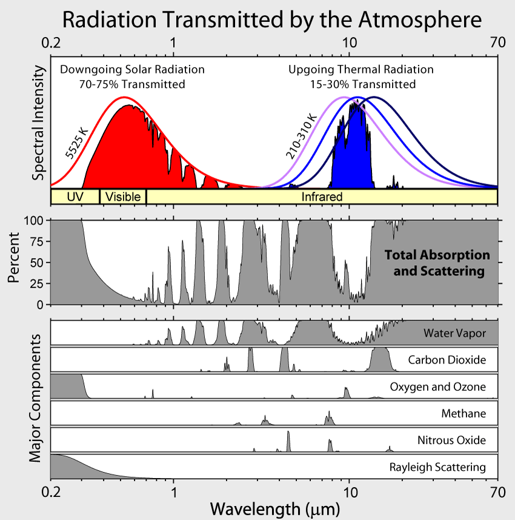
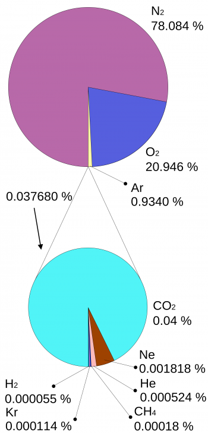
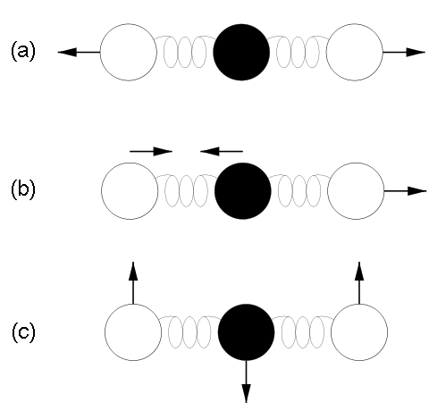
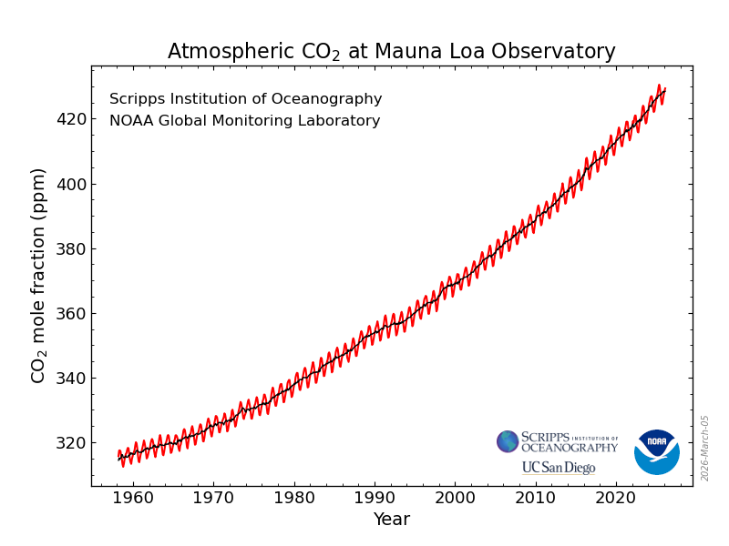

<!-- _class: lead -->

# Origins

### Fourier, Tyndall, Arrhenius, and the Keeling Curve

Week 1 · Module 1: Climate Science Foundations

---

## Today

- What climate science actually studies
- Four discoveries, 1824 → 1958
- Common criticisms, addressed directly
- Open questions nobody has closed

Discussion-style. Interrupt, disagree, ask.

---

## Weather vs. Climate

- **Weather** — state of the atmosphere right now: minutes to days, chaotic, unpredictable past ~2 weeks
- **Climate** — statistics of weather over months to decades: mean, variance, extremes

> "Climate is what you expect. Weather is what you get."

**Discuss:** a cold week in Lahore — does it say anything about climate change? Why or why not?

---

## What Climate Science Studies

Not just the atmosphere. The climate *system*:

- Atmosphere, ocean, ice, land surface, biosphere — interacting
- All life sits in a layer about 1,000x thinner than Earth's radius
- Climate is predictable *if the forcing is known* — energy conservation, not guesswork

**Question for the room:** if climate is "just" energy conservation, why is it hard to predict regional impacts?

---

<!-- _class: lead -->

# Part 1: The Timeline

1824 → 1859 → 1896 → 1958

---

## 1824 — Fourier

- Joseph Fourier asks: why is Earth warmer than a bare rock at this distance from the sun should be?
- A airless, reflective Earth works out to about **255 K (−18°C)**
- Actual surface average: **15°C** — something traps heat
- Fourier proposes the atmosphere itself as the reason

**Discuss:** Fourier had no lab measurement of *which* gases, or *how much*. Why publish anyway?

---

## 1859 — Tyndall

- John Tyndall measures infrared absorption of individual gases in the lab, Royal Institution
- Confirms Fourier's guess with data: the atmosphere is nearly transparent to incoming sunlight, but mostly opaque to outgoing infrared
- Only a narrow window near 10 μm lets Earth's heat escape freely

**Discuss:** the top panel shows sunlight in, the middle shows what the whole atmosphere blocks. What does the gap between them represent, physically?

---

## Why CO₂, and Not N₂ or O₂?

- N₂ and O₂ make up 99% of dry air, yet are almost transparent to infrared
- CO₂ is 0.04% of dry air, yet is one of the strongest absorbers
- Reason: N₂/O₂ molecules are symmetric, no dipole moment; CO₂ and H₂O flex into shapes that do

 

**Discuss:** most of the atmosphere is "invisible" to this effect. Why does that make CO₂ *more* dangerous to perturb, not less?

---

## 1896 — Arrhenius

- Svante Arrhenius does the first quantitative calculation: doubling CO₂ → roughly 5–6°C warming
- Motivation was originally about explaining past ice ages, not predicting the future
- He thought a warmer world might benefit agriculture at high latitudes

**Discuss:** Arrhenius's number is in the same ballpark as modern estimates. Is that impressive, or a coincidence worth being suspicious of?

---

## 1958 — Keeling

- Charles Keeling starts continuous CO₂ monitoring at Mauna Loa Observatory, Hawaii
- Starting value: just under 320 ppm. Today: over 420 ppm — a 25% increase
- The record also shows a seasonal sawtooth: northern-hemisphere spring growth draws CO₂ down, autumn decay pushes it back up

**Discuss:** the sawtooth is the planet visibly "breathing." What does it tell you about *where* most land vegetation is?

---

## Why This Timeline Matters

- The mechanism (Fourier) came before the measurement (Tyndall)
- The quantitative prediction (Arrhenius, 1896) came 60+ years before the data that could test it (Keeling, 1958)
- This is a rare case in science: a numerical forecast made, then confirmed generations later

**Discuss:** does knowing this history change how you weigh "the models might be wrong" as an argument?

---

<!-- _class: lead -->

# Part 2: Common Criticisms

Address them directly, not defensively

---

## "The climate has changed before, naturally"

- True — ice ages, the Holocene optimum, all real
- Not in dispute. The question is never *whether* climate changes, it is *what is driving this particular change*
- Past changes had known forcings (orbital cycles, volcanic, solar) that do not match the pace or fingerprint of the last 150 years

**Discuss:** what would "the fingerprint of the last 150 years" need to look like, to rule out a natural cause?

---

## "Scientists don't agree"

- Survey of the peer-reviewed literature: roughly 97% of climate scientists attribute recent warming mostly or entirely to human activity (Cook et al., 2013)
- Public perception is far more split — about half of Americans, in contemporaneous polling
- That gap is itself worth explaining, not just citing

**Discuss:** where does the gap between scientific consensus and public opinion come from? Media framing, motivated reasoning, something else?

---

## "It's called the *greenhouse* effect, but..."

- Actual greenhouses stay warm mostly by blocking convection (trapping warm air), not by trapping infrared radiation
- The atmospheric effect Fourier/Tyndall/Arrhenius describe is a genuinely different mechanism, wearing a borrowed, slightly wrong name
- A minor point, but a good test: can you explain *why* the name is misleading?

---

<!-- _class: lead -->

# Part 3: Open Questions

What this course does not pretend to have closed

---

## Genuinely Open

- **Climate sensitivity** — the exact warming per doubling of CO₂ still spans a real range, not a single number
- **Tipping points** — thresholds for ice-sheet collapse, permafrost carbon release: existence widely accepted, timing much less certain
- **Regional projection** — global energy balance is well constrained; what happens to monsoon timing over Pakistan specifically is a harder problem

**Discuss:** which of these three would you most want resolved before making a policy decision?

---

## For Next Class

- Read: Arrhenius (1896) — see how much of today's story you can find already there
- Bring one question this lecture did not answer
- Bring one criticism you have heard that we did not cover today
